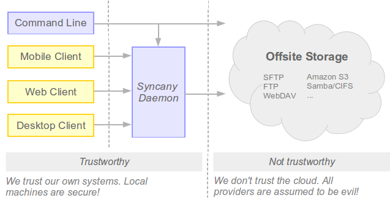
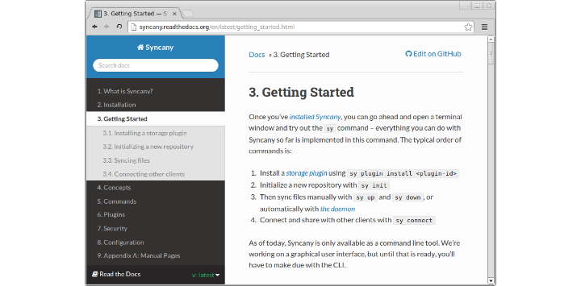

Syncany
=======
       

Syncany is an open-source cloud storage and filesharing application. It allows
users to backup and share certain folders of their workstations using any kind
of storage, e.g. FTP, SFTP, WebDAV, Amazon S3 and Samba.

While the basic idea is similar to Dropbox, Syncany is
open-source and additionally provides data encryption and more flexibility in
terms of storage type and provider:

- **Data encryption**: Syncany encrypts the files locally, so that any online
  storage can be used even for sensitive data.
- **Any storage**: Syncany uses a plug-in based storage system. It can
  be used with any type of remote storage.

Installation
------------
You can download the current binary packages and installers from the [releases page](https://github.com/syncany/syncany/releases), or from the Syncany [download site](https://www.syncany.org/dist/releases/?C=M;O=D). For details on how to install Syncany, check out the **[download/install instructions](http://syncany.readthedocs.org/en/latest/installation.html)**.

**Please be aware that this is still ALPHA code! Do not use it for important files.**

Getting Started
---------------
To learn how to use Syncany, check out the brand new and awesome **[Syncany User Guide](http://syncany.readthedocs.org/)**. It'll tell you everything you want to know. For a step-by-step guide, navigate to the [Getting Started](http://syncany.readthedocs.org/en/latest/getting_started.html) page!

Building
--------
Excited? Want to help? Or just build it yourself? For information about building, development, documentation, screencasts, diagrams and contributions, please check out **[the Syncany wiki page](https://github.com/syncany/syncany/wiki)**. It'll hopefully give you all the information you need!

Buy us a coffee
---------------
If you like what you see and you want to support us, you can buy us a coffee or a beer. There are maaanny ways to do so.

Break some hashes for us by [donating some Bitcoins](https://blockchain.info/address/1626wjrw3uWk9adyjCfYwafw4sQWujyjn8) (also via [tip4commit](http://tip4commit.com/github/syncany/syncany)); or be a charmer and [flattr us](https://flattr.com/thing/290043/Syncany). If that's not for you, why not give us some change [with PayPal](http://www.syncany.org/donate.html)? Any contributions are much appreciated!

Licensing, website and contact
------------------------------
Syncany is licensed under the GPLv3 open source license. It is actively developed by [Philipp C. Heckel](http://blog.philippheckel.com/), the [Syncany Team](https://github.com/orgs/syncany/teams/syncany-team) and [many](AUTHORS.md) [others](https://github.com/syncany/syncany/graphs/contributors). We are always looking for people to join or help out. Feel free to contact us:

- [Syncany Website](https://www.syncany.org/), the main website
- [Syncany User Guide](http://syncany.readthedocs.org/), **most important resource for end users**
- [Syncany Wiki](https://github.com/syncany/syncany/wiki), most important resource for developers
- [IRC channel #syncany on Freenode](https://webchat.freenode.net/?channels=syncany) (**active!**, my nick is *binwiederhier*)
- [@syncany on Twitter](https://twitter.com/#!/syncany), somewhat quiet there, though ...
- [Mailing list](https://launchpad.net/~syncany-team), still on Launchpad
